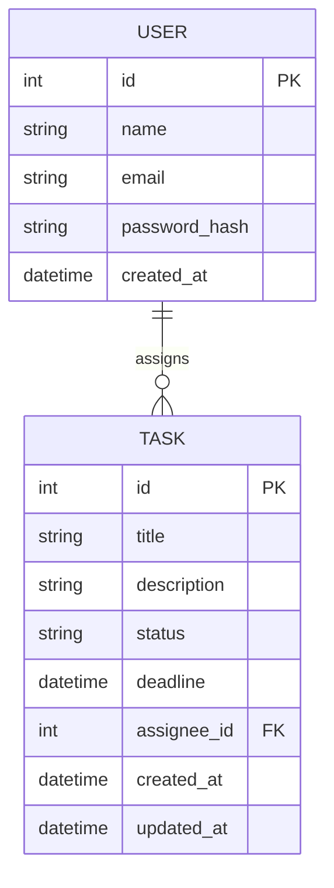

```mermaid
erDiagram
    USER ||--o{ TASK : assigns
    USER {
        int id PK
        string name
        string email
        string password_hash
        datetime created_at
    }
    TASK {
        int id PK
        string title
        string description
        string status
        datetime deadline
        int assignee_id FK
        datetime created_at
        datetime updated_at
    }
```

Export this mermaid diagram to PNG/PDF if needed.
